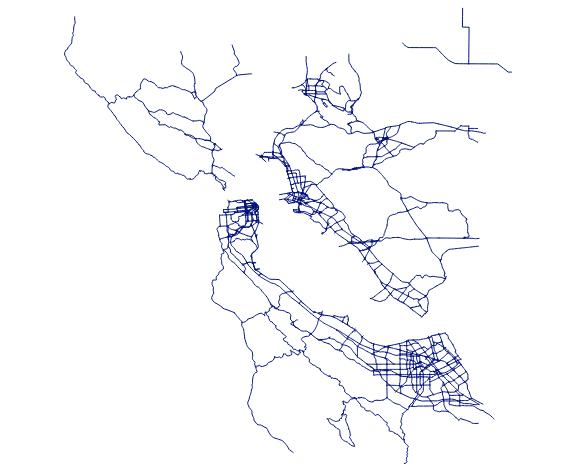
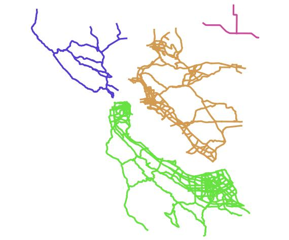

# geojson-id-disconnected-networks
In a GeoJSON LineString Feature Collection, Identify network areas separate from each other.

Note:  I'd advise using the `connectedComponents` export from [geojson-to-adjacency-list](https://github.com/royhobbstn/geojson-to-adjacency-list) for a more classic approach to this task.

## When to Use

Many network routing routines accept input from users in the form of Lat/Lng.  Generally they use the input Lat/Lng coordinates to locate nearby network nodes from which to start and / or end a route.  With an uncleaned network, it's possible that this process may find a node that is not connected to the main network.  This library will help identify sub-network areas that are disconnected from the main network.

# Example

Here's an example of a network dataset that has several disconnected sub-networks:



Running your GeoJSON network dataset through this tool will yield an additional property `subnetworkId` on each feature's `properties` object. The value of `subnetworkId` is an integer corresponding to the sub-network size rank. (`1` is the largest sub-network).

If you map the updated dataset by `subnetworkId` categorically, you will get a result that looks like:



# Install

```
npm install geojson-id-disconnected-networks
```

Then:

```

const fs = require('fs').promises;
const idAreas = require('geojson-id-disconnected-networks');


main();

async function main() {

  const geojson_raw = await fs.readFile('./full_network.geojson');
  const geojson = JSON.parse(geojson_raw);

  const altered_network = idAreas(geojson);
  
  // altered_network contains a new geojson property; subnetworkId

  await fs.writeFile('./altered_network.geojson', JSON.stringify(updated_network), 'utf8');

}

```

# How It Works

This library uses [Dijkstra's Algorithm](https://en.wikipedia.org/wiki/Dijkstra%27s_algorithm) to travel the network between an origin and a destination.  Because the algorithm travels each possible node along the way, by keeping track of the nodes traveled we can get a full accounting of each sub-network.

# Credits

I'm greatly indebted to the work of Stella Chung, who created [a very approachable guide](https://hackernoon.com/how-to-implement-dijkstras-algorithm-in-javascript-abdfd1702d04) to implementing Dijkstra's Algorithm in JavaScript.

You can follow her [@stellasometimes](https://twitter.com/stellasometimes) on Twitter.
